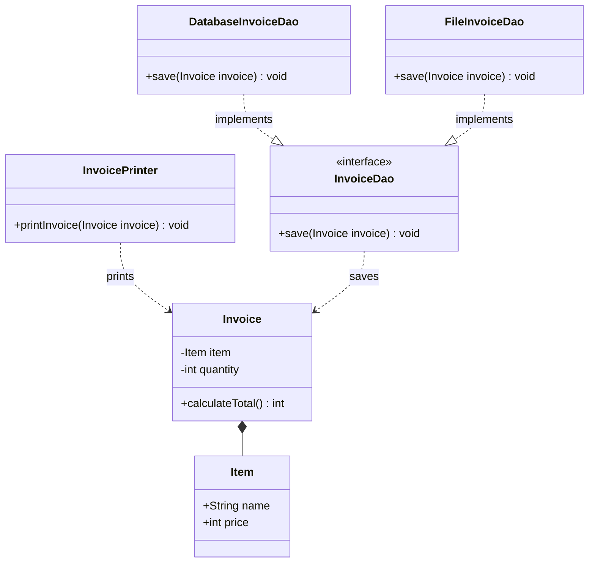

# SOLID Principles: Low-Level Design Foundations

SOLID principles form the bedrock of decoupled, testable, and extensible object-oriented code, preventing software decay and architectural fragility.

---

## The 5 Core Principles

| Principle                     | Core Smelling Signal                                                     | Clean Solution Architecture                                                             |
| :---------------------------- | :----------------------------------------------------------------------- | :-------------------------------------------------------------------------------------- |
| **S** - Single Responsibility | A class has multiple reasons to change (e.g., calculation + printing).   | Segregate calculation (`Invoice`) and presentation (`InvoicePrinter`).                  |
| **O** - Open/Closed           | Cascading `if-else` / `switch` blocks whenever a new target is added.    | Depend on interfaces (`InvoiceDao`); extend via `DatabaseInvoiceDao`, `FileInvoiceDao`. |
| **L** - Liskov Substitution   | Subclasses throw `UnsupportedOperationException` or alter base behavior. | Move specialized capabilities down (`EngineVehicle` vs base `Vehicle` for `Bicycle`).   |
| **I** - Interface Segregation | "Fat" interfaces with blank, dummy, or unsupported methods.              | Segregate into role-specific contracts (`WaiterInterface`, `ChefInterface`).            |
| **D** - Dependency Inversion  | High-level classes instantiating low-level modules using `new`.          | Invert control via constructor injection using contracts (`Keyboard`, `Mouse`).         |

---

## Architectural Blueprint

---

## Interview Traps & Defenses

### 1. LSP vs. Runtime Polymorphism

- **Trap Question:** "Can't I just check `if (vehicle instanceof Bicycle)` before calling `startEngine()`?"
- **Defense:** Explicit runtime type checking (`instanceof`) completely undermines polymorphism and violates the Open/Closed Principle. If you must inspect types at runtime, your inheritance hierarchy is flawed. Move engine logic into an intermediate `EngineVehicle` abstraction so `Bicycle` never inherits it.

### 2. DIP vs. Spring Dependency Injection

- **Trap Question:** "Is Dependency Inversion just Spring's `@Autowired` annotation?"
- **Defense:** No. Dependency Inversion is a high-level architectural principle stating that modules must depend on abstractions, not concrete details. Dependency Injection is a creational design pattern used to implement DIP. Spring is merely an application framework that automates DI via an inversion-of-control container.

